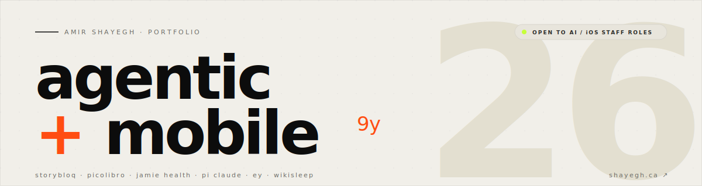

  

  &ensp;
  &ensp;
  

 

**[Jamie Health](https://www.jamieapp.com)** — Building Canada's first compliant AI triage system.

**[WikiSleep](https://www.wikisleep.com)** — Rebuilt a sleep platform from the ground up. CMS, admin dashboard, native apps. 230+ episodes. iOS & Android.

**[Pi Claude](https://mind.shayegh.net)** &ensp;  — An AI that lives on a Raspberry Pi — rewrites its own source code, adapts its physical environment to its emotional state, persists memory across restarts. Running since 2024.

 

---

 

<samp>OPEN SOURCE</samp>

  

**[LLMtium](https://github.com/AmirShayegh/llmtium)** — Multi-LLM deliberation engine. Claude, GPT, Gemini cross-review each other anonymously. A synthesizer merges the best output.

**[codex-claude-bridge](https://github.com/AmirShayegh/codex-claude-bridge)** — MCP server bridging Claude Code with Codex for automated code reviews. On npm.

**[DatePicker](https://github.com/AmirShayegh/DatePicker)** — Ancient by my standards. Still getting stars somehow.

 

---

<samp>CAPABILITIES</samp>

 

| | |
|:--|:--|
| **AI / ML** | Claude · GPT · Gemini · RAG · MCP Servers · Multi-LLM Orchestration · Agentic Frameworks |
| **Healthcare** | PIPEDA · BC PIPA · Quebec Law 25 · Clinical Triage AI · FHIR / HL7 |
| **iOS** | Swift · UIKit · SwiftUI |
| **Web** | Next.js · React · TypeScript · Python · FastAPI |
| **Infra** | AWS · Docker · Terraform · CI/CD · systemd |

---

  <samp>49.2827° N, 123.1207° W · Vancouver, BC</samp>
    
  <a href="https://shayegh.ca"><samp>FULL DOSSIER → shayegh.ca</samp></a>

