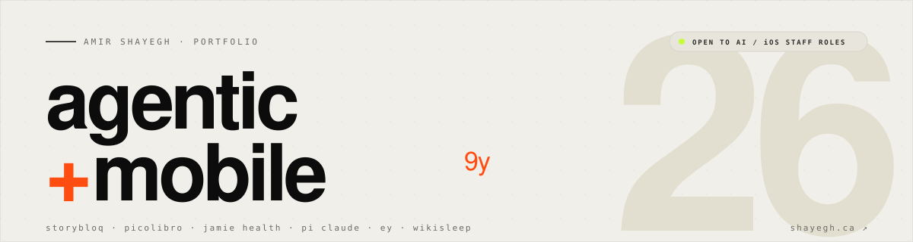

  

  &ensp;
  

 

With a full-time job, I needed more discipline around my personal projects to make the most of limited time. So I built Storybloq. It's free and open source.

 

**[Storybloq/storybloq](https://github.com/Storybloq/storybloq)** &ensp; 
 
Cross-session context for Claude Code. CLI + MCP server + /story skill that tracks tickets, issues, handovers, and roadmap in a `.story/` directory.

 

Claude and ChatGPT have different perspectives. They're good at different things. This bridge lets Claude get Codex's perspective during code review.

**[codex-claude-bridge](https://github.com/AmirShayegh/codex-claude-bridge)** &ensp; 
 
MCP server bridging Claude Code with OpenAI Codex for automated code reviews. Published on npm.

 

An experiment in understanding how various LLMs can work together to improve results, and in understanding the strengths of different LLMs.

**[LLMtium](https://github.com/AmirShayegh/llmtium)**
 
Multi-LLM deliberation engine. One prompt to Claude, GPT, and Gemini for anonymized cross-review with a synthesizer that merges the best output.

 

**[probe-loop](https://github.com/AmirShayegh/probe-loop)**
 
A Claude Code plugin for verifying software against the real runtime. QA and dev in one. E2E testing, plus. A pattern every developer using AI already does but hasn't formalized.

 

**[SwiftLogger](https://github.com/AmirShayegh/SwiftLogger)**
 
Thread-safe Swift logging with structured metadata.

 

**[DatePicker](https://github.com/AmirShayegh/DatePicker)** &ensp; 
 
A clean date picker with calendar for iPhone and iPad. Old, but still drawing traffic.
